# Mermaid-序列图

[TOC]


> 序列图展示了两个程序的交互顺序

Mermaid 可以渲染序列图

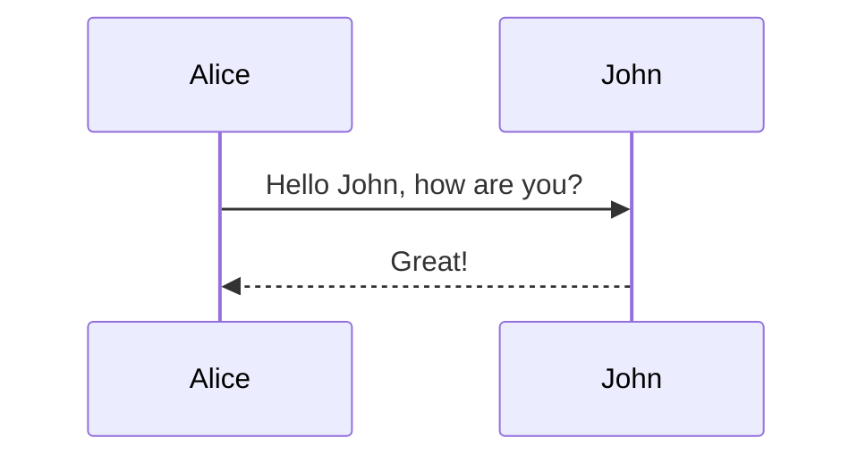


## 语法

### 参与者

参与者可以被隐式的定义，不需要额外声明，例如上面的例子；参与者或者动作是按照定义的顺序进行渲染的，如果需要自定义顺序，可以如下面所示定义：

```
sequenceDiagram
    participant John
    participant Alice
    Alice->>John: Hello John, how are you?
    John-->>Alice: Great!
```

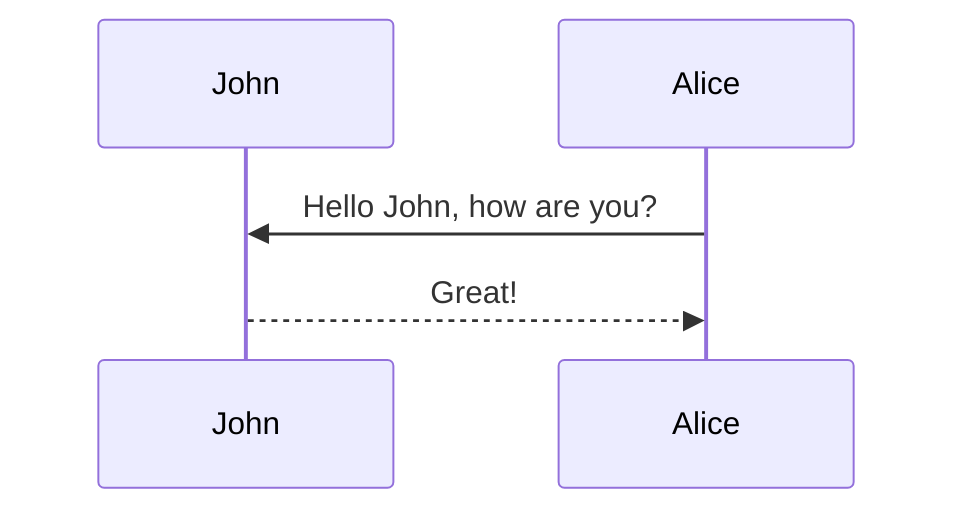


### 别名

参与者可以定义别名

```
sequenceDiagram
    participant A as Alice
    participant J as John
    A->>J: Hello John, how are you?
    J->>A: Great!
```


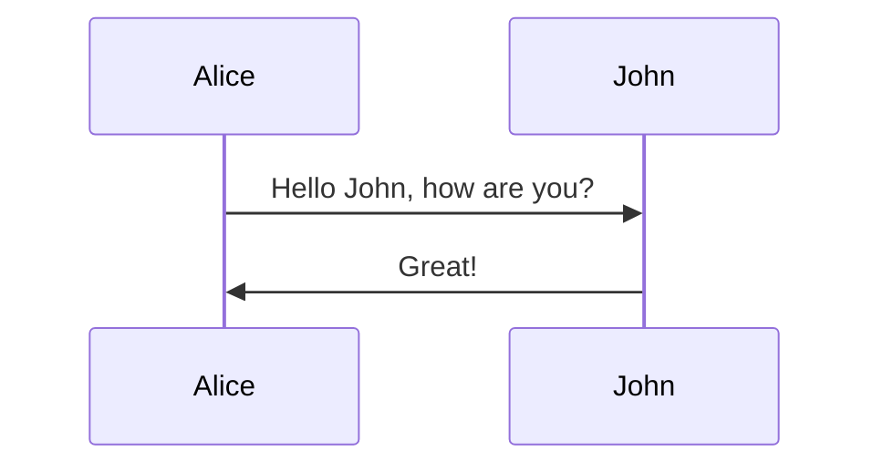


## 消息

消息可以被显示为实线或者点划线


```
[Actor][Arrow][Actor]:Message text
```

支持下面6中箭头形式：

类型 | 描述 
---  | ---
->   | 无箭头实线 
-->  | 无箭头点划线 
->>  | 实线带箭头 
-->> | 点划线带箭头 
-x   | 实线带 `x` 
--x  | 点划线带`x` 

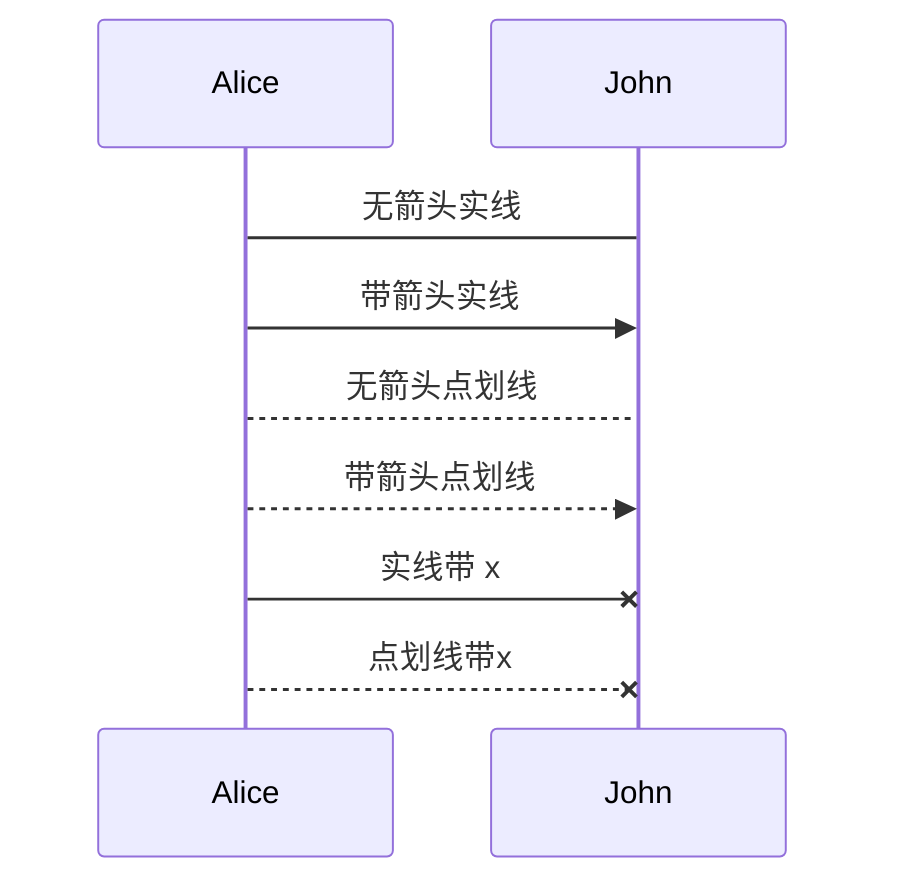


## 活动

可以激活或者停止一个对象，可以专门声明

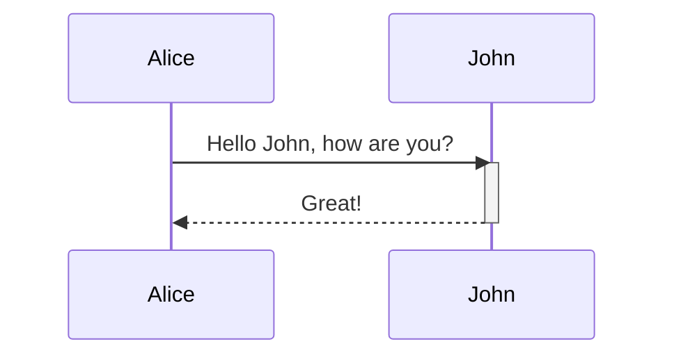


可以通过添加 `+`/`-`到箭头右侧来简短的进行激活/停止

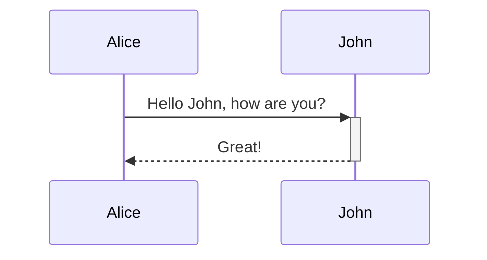


同一个对象的激活动作可以重叠

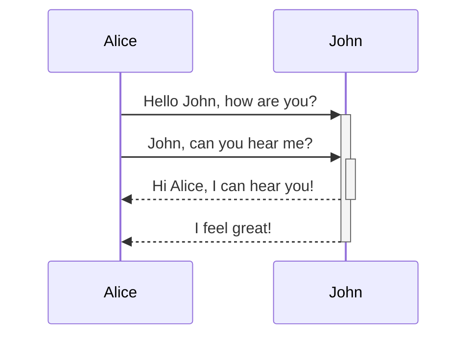


## 注释

可以为序列图添加注释

**语法如下：**

```
Note [ right of | left of | over ] [Actor]: Text in note content
```

例如：

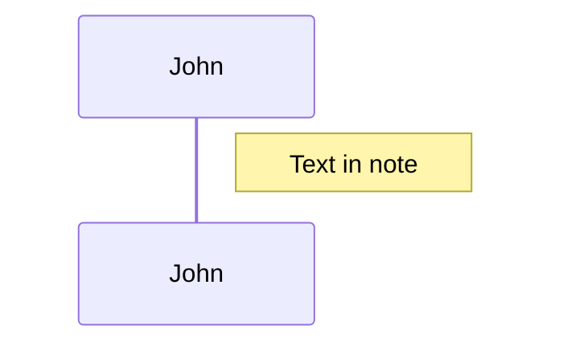


注释可以跨越两个参与者：

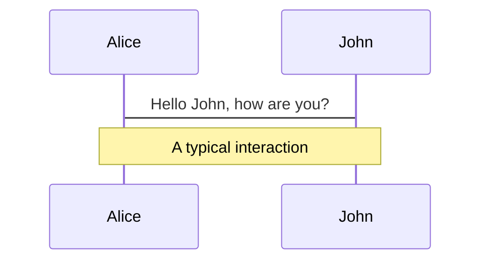


## 循环(Loops)

使用下面的符号表示循环

```
loop Loop text
... statements ...
end
```

See the example below:

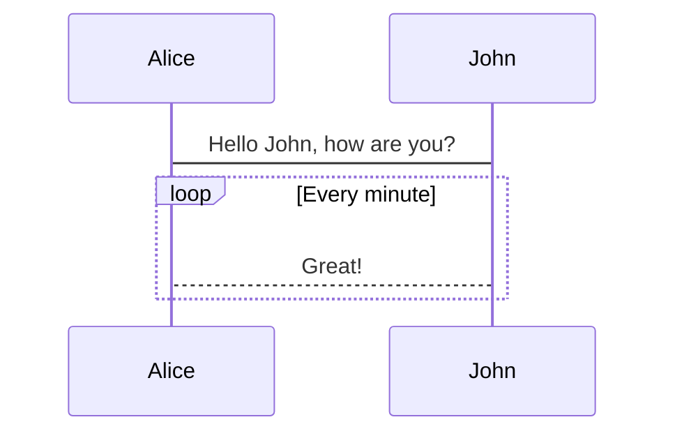


## 多选一(Alt)

可以在序列图中表达多选一(alternative paths)，使用下面的符号：

```
alt Describing text
... statements ...
else
... statements ...
end
```

可选路径(无else)：

```
opt Describing text
... statements ...
end
```

例如：

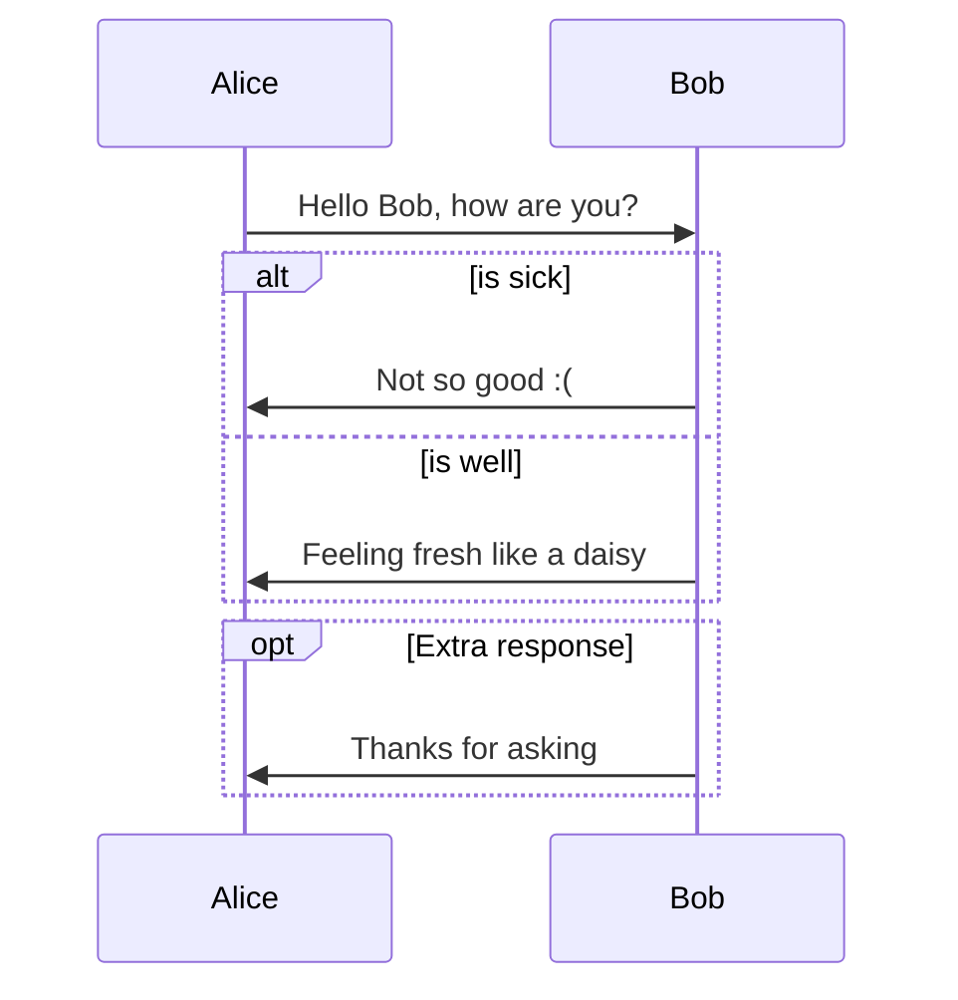

## 样式

序列图的样式通过定义一系列的css类来定义

### 使用的类

类        | 描述 
---          | ---
actor        | Style for the actor box at the top of the diagram.
text.actor   | Styles for text in the actor box at the top of the diagram.
actor-line   | The vertical line for an actor.
messageLine0 | Styles for the solid message line.
messageLine1 | Styles for the dotted message line.
messageText  | Defines styles for the text on the message arrows.
labelBox     | Defines styles label to left in a loop.
labelText    | Styles for the text in label for loops.
loopText     | Styles for the text in the loop box.
loopLine     | Defines styles for the lines in the loop box.
note         | Styles for the note box.
noteText     | Styles for the text on in the note boxes.


### stylesheet实例


```css
body {
    background: white;
}

.actor {
    stroke: #CCCCFF;
    fill: #ECECFF;
}
text.actor {
    fill:black;
    stroke:none;
    font-family: Helvetica;
}

.actor-line {
    stroke:grey;
}

.messageLine0 {
    stroke-width:1.5;
    stroke-dasharray: "2 2";
    marker-end:"url(#arrowhead)";
    stroke:black;
}

.messageLine1 {
    stroke-width:1.5;
    stroke-dasharray: "2 2";
    stroke:black;
}

#arrowhead {
    fill:black;

}

.messageText {
    fill:black;
    stroke:none;
    font-family: 'trebuchet ms', verdana, arial;
    font-size:14px;
}

.labelBox {
    stroke: #CCCCFF;
    fill: #ECECFF;
}

.labelText {
    fill:black;
    stroke:none;
    font-family: 'trebuchet ms', verdana, arial;
}

.loopText {
    fill:black;
    stroke:none;
    font-family: 'trebuchet ms', verdana, arial;
}

.loopLine {
    stroke-width:2;
    stroke-dasharray: "2 2";
    marker-end:"url(#arrowhead)";
    stroke: #CCCCFF;
}

.note {
    stroke: #decc93;
    stroke: #CCCCFF;
    fill: #fff5ad;
}

.noteText {
    fill:black;
    stroke:none;
    font-family: 'trebuchet ms', verdana, arial;
    font-size:14px;
}
```


## 参考链接

官方文档： https://mermaidjs.github.io/#/

github库： https://github.com/knsv/mermaid

